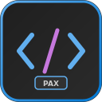

# Pax Code

<p align="center">
  
</p>

<p align="center">
  <strong>A beautiful dark theme and keyboard shortcuts reference panel for VS Code</strong>
</p>

<p align="center">
  <a href="https://marketplace.visualstudio.com/items?itemName=Pax97.pax-code">
    
  </a>
  <a href="https://marketplace.visualstudio.com/items?itemName=Pax97.pax-code">
    
  </a>
  <a href="https://github.com/Pax97/pax-code/blob/main/LICENSE">
    
  </a>
</p>

---

## ✨ Features

### 🎨 Dark Themes

Pax Code comes with two carefully crafted dark themes:

- **Night Theme** - A comfortable dark theme with balanced contrast
- **Night Theme Vivid** - A more vibrant version with enhanced colors

Both themes feature:

- Semantic highlighting support
- Optimized syntax colors for multiple languages
- Easy on the eyes for long coding sessions

### ⌨️ Hotkeys Reference Panel

Pax Code adds a **Hotkeys** panel to your Activity Bar for quick shortcut reference.

- 📁 **Grouped by Category** – Font/Zoom, Editor Tabs, Explorer, Terminal, Selection/Editing
- 🔍 **Quick Reference** – View shortcuts at a glance
- ⚡ **Auto-load** – Loaded automatically on VS Code start
- 👤 **Profile-aware** – Hotkeys are isolated per VS Code Profile
- ⚠️ **Validation & Warnings** – Invalid entries are detected and warned
- 🚨 **Duplicate Highlighting** – Conflicting shortcuts are highlighted in red

## 🧠 Smart Hotkey Validation

When importing a `hotkeys.json` file, Pax Code performs automatic checks.

### ✅ Schema Validation

- Required fields:
  - `group`
  - `label`
  - `key`
  - `command`
- Optional field:
  - `when`
- Invalid or missing fields trigger **warnings** (non-blocking)
- Data is still loaded to avoid interrupting workflow

### 🚨 Duplicate Shortcut Detection (key + when)

- Shortcuts are considered duplicates **only if both `key` and `when` match**
- Empty or missing `when` is treated as **global**
- Duplicate entries:
  - Trigger a warning during import
  - Are highlighted with a **red error icon**
  - Display a `DUPLICATE` label and tooltip in the Hotkeys panel

## 📦 Installation

### From VS Code Marketplace

1. Open VS Code
2. Go to Extensions (`Cmd+Shift+X` / `Ctrl+Shift+X`)
3. Search for "Pax Code"
4. Click **Install**

### From VSIX File

```bash
code --install-extension pax-code-x.x.x.vsix
```

## 🚀 Usage

### Activating the Theme

1. Open Command Palette (`Cmd+Shift+P` / `Ctrl+Shift+P`)
2. Type "Color Theme"
3. Select **Preferences: Color Theme**
4. Choose **Night Theme** or **Night Theme Vivid**

### Using Hotkeys Panel

1. Click on the **Hotkeys** icon in the Activity Bar (left sidebar)
2. Expand categories to see available shortcuts

## ⚙️ Configuration

### Custom Hotkeys

Pax Code **does not require editing extension files directly**.
Instead, you can import your own hotkeys configuration safely.

#### 1️⃣ Use the Sample Hotkeys File (Recommended)

Start with the official sample file provided by Pax Code: [hotkeys.json](hotkeys.json)

You can download this file and modify it to fit your workflow.

---

#### 2️⃣ Hotkeys JSON Format

Each hotkey entry supports the following structure:

```json
{
  "group": "Category Name",
  "label": "Action Description",
  "key": "cmd+shift+p",
  "command": "workbench.action.showCommands",
  "when": "editorTextFocus"
}
```

## 🛠️ Development

### Prerequisites

- Node.js 20+
- Yarn or npm

### Setup

```bash
# Clone the repository
git clone https://github.com/sanglq/pax-code.git
cd pax-code

# Install dependencies
yarn install

# Compile
yarn compile

# Watch mode
yarn watch
```

### Building VSIX

```bash
# Package the extension
yarn package
npx vsce package
```

## 🤝 Contributing

Contributions are welcome! Please feel free to submit a Pull Request.

1. Fork the repository
2. Create your feature branch (`git checkout -b feature/amazing-feature`)
3. Commit your changes (`git commit -m 'Add some amazing feature'`)
4. Push to the branch (`git push origin feature/amazing-feature`)
5. Open a Pull Request

## 📄 License

This project is licensed under the MIT License - see the [LICENSE](LICENSE) file for details.

---

<p align="center">
  Made with ❤️ by <a href="https://github.com/sanglq">sanglq</a>
</p>
